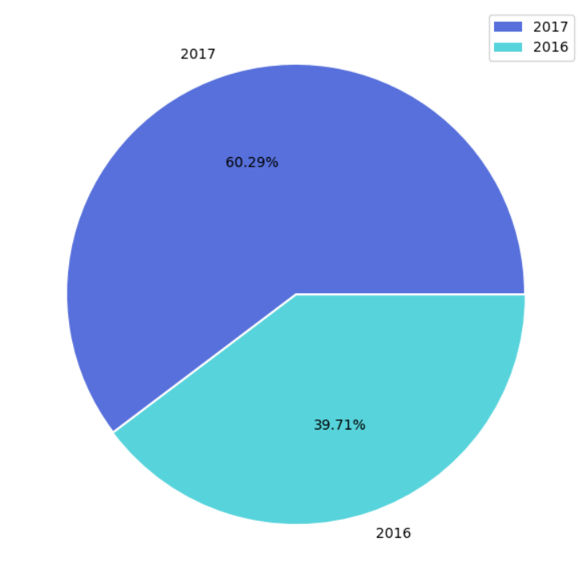

# Laporan Proyek Machine Learning

### Nama : Muhammad Salman Athoriq

### Nim : 211351101

### Kelas : IF Malam A

## Domain Proyek

Kita hidup di era e-commerce dan pemasaran digital. Kami bahkan memiliki bisnis skala kecil yang online karena peluangnya tidak terbatas. Karena sebagian besar orang yang memiliki akses internet beralih ke belanja online, pengecer besar secara aktif mencari cara untuk meningkatkan keuntungan mereka. Analisis Keranjang Pasar adalah salah satu teknik utama yang digunakan oleh pengecer besar untuk meningkatkan penjualan dengan memahami perilaku & pola pembelian pelanggan. Analisis keranjang pasar memeriksa kumpulan item untuk menemukan hubungan antar item yang berjalan bersama dalam konteks bisnis.

## Business Understanding

Dikarnakan pelanggan terkadang bingung mencari barang yang ingin di beli , maka kami ingin memprediksi keseringan suatu barang di beli dengan mengetahui terlebih dahulu barang apa yang sebelum nya di beli. Sehingga kami ingin memindahkan barang yang kedua dekat dengan barang yang pertama.

### Problem Statements

Menjelaskan pernyataan masalah latar belakang:

-   Toko ingin menambah produk yang frekuensi terjual nya tinggi 
-   Toko tidak dapat mempermudah pelanggan di dalam mencari barang 

### Goals Dengan Solution Statements

Menjelaskan tujuan dari pernyataan masalah:

-   Membuat penelitian untuk dapat memprediksi produk selanjutnya yang akan di beli pelanggan (Menggunakan algorita apriori)
-   Mendapatkan wawasan pada produk yang biasa di beli bersamaan oleh pelanggan 

## Import Dataset

\[Bakery Sales Dataset\]\[https://www.kaggle.com/datasets/akashdeepkuila/bakery/data)

Pertama-tama saya upload kaggle.json untuk memiliki akses pada kaggle

``` python
from google.colab import files
files.upload()
```
Selanjutnya membuat direktori dan permission pada skrip ini

``` python
!mkdir -p ~/.kaggle
!cp kaggle.json ~/.kaggle/
!chmod 600 ~/.kaggle/kaggle.json
!ls ~/.kaggle
```
Lalu mendownload dataset tersebut

``` python
!kaggle datasets download -d akashdeepkuila/bakery/
```
Mengunzip dataset

```python
!mkdir bakery
!unzip bakery.zip -d bakery
!ls bakery
```

## Import Library


``` python
import pandas as pd
import numpy as np
import seaborn as sns
import matplotlib.pyplot as plt
import plotly.figure_factory as ff
import plotly.graph_objects as go
from plotly.offline import download_plotlyjs, init_notebook_mode, iplot
from itertools import combinations
from mlxtend.preprocessing import TransactionEncoder
from mlxtend.frequent_patterns import apriori, association_rules
import networkx as nx
```

## Data Discovery

Membaca data csv
``` python
df = pd.read_csv("Bakery.csv")
```


Memeriksa berapa baris dan kolom

``` python

df.shape
```


``` python

df.describe()
```


``` python
df.info()
```


### Variabel-variabel pada Laptop Prices Dataset adalah sebagai berikut:

-   TransactionNo : Merupakan identifier unik untuk setiap transaksi \[Bertipe:Integer ,Contoh: 1187,4941\]
-   DateTime : Merupakan tahun , bulan , hari , jam , menit dan detik transaksi \[Bertipe:Date , Contoh: 2015-12-12 09:58:11\]
-   Items : Merupakan bahan groceries \[Bertipe:String , Contoh: Cookies\]
-   Daypart : Merupakan bagian dari hari ketika transaksi dilakukan \[Bertipe:String , Contoh: Morning\]
-   DayType : Merupakan penentuan transaksi dilakukan pada weekday atau weekend \[Bertipe:String, Contoh: Weekend\]
  
## EDA

``` python
len(df["TransactionNo"].value_counts())
val_counts = dict(df["Items"].value_counts()[:10])
plt.figure(figsize=(12,6))
sns.barplot(x=list(val_counts.keys()), y=list(val_counts.values()), palette="Greens_r")
```


```python
daypart = dict(df.groupby('Daypart')['Items'].count().sort_values(ascending=False))
plt.figure(figsize=(10,6))
plt.pie(daypart.values(), labels=daypart.keys(), explode=[0, 0.01, 0.2, 0.5], colors = sns.color_palette("Set2")[1:], autopct='%.2f%%')
plt.tight_layout()
plt.legend()
plt.show()
```


```python
daytype = dict(df.groupby("DayType")["Items"].count().sort_values(ascending=False))
plt.figure(figsize=(10,6))
plt.pie(daytype.values(), labels=daytype.keys(), explode = [0, 0.01], colors = sns.color_palette("Set2")[5:7], autopct='%.2f%%')
plt.tight_layout()
plt.legend()
plt.show()
```


```python
weekday = dict(df.groupby("weekday")["Items"].count().sort_values(ascending=False))
plt.figure(figsize=(10,6))
sns.barplot(y=list(weekday.keys()), x=list(weekday.values()), palette="Reds_r", orient = "h")
```


```python
year = dict(df.groupby("year")["Items"].count().sort_values(ascending=False))
plt.figure(figsize=(10,6))
plt.pie(year.values(), labels=year.keys(), explode = [0, 0.01], colors = sns.color_palette("hls",8)[5:3:-1], autopct='%.2f%%')
plt.tight_layout()
plt.legend()
plt.show()
```


```python
month = dict(df.groupby("month")["Items"].count().sort_values(ascending=False))
plt.figure(figsize=(14,6))
sns.barplot(x=["March", "November", "January", "February", "December", "April", "October", "May", "July", "June", "August", "September"],
            y=list(month.values()), palette="Purples_r")
```


## Data Preprocessing

Sebelum data di jadikan model , data perlu di proses kembali dan di siapkan untuk permodelan. 

```python
val_counts = df["Items"].value_counts()
val_counts.tail(10)
```

Memeriksa berapa banyak fitur yang memiliki nilai null

``` python
excluded = list(val_counts[val_counts.values < 2].index)
transactions=[]
for action in df2["TransactionNo"].unique():
    transaction=list(set(df2[df2["TransactionNo"]==action]['Items']))
    if not any(x in transaction for x in excluded):
        if len(transaction) != 1:
            transactions.append(transaction)
```


``` python

len(transactions)
```

```python
transactions=[]
for item in df['TransactionNo'].unique():
    lst=list(set(df[df['TransactionNo']==item]['Items']))
    transactions.append(lst)

transactions[0:10]
```


## Modeling

Menerapkan algoritma apriori

``` python
te = TransactionEncoder()
encodedData = te.fit(transactions).transform(transactions)
data = pd.DataFrame(encodedData, columns=te.columns_)
data.head()
```


``` python
frequentItems= apriori(data, use_colnames=True, min_support=0.02)
frequentItems.head()
```

``` python
rules = association_rules(frequentItems, metric="lift", min_threshold=1)
rules.antecedents = rules.antecedents.apply(lambda x: next(iter(x)))
rules.consequents = rules.consequents.apply(lambda x: next(iter(x)))
rules.head()
```
## Visualisasi Hasil Algoritma

```python
network_A = list(rules["antecedents"].unique())
network_B = list(rules["consequents"].unique())
node_list = list(set(network_A + network_B))
G = nx.Graph()
for i in node_list:
    G.add_node(i)
for i,j in rules.iterrows():
    G.add_edges_from([(j["antecedents"], j["consequents"])])
pos = nx.spring_layout(G, k=0.5, dim=2, iterations=400)
for n, p in pos.items():
    G.nodes[n]['pos'] = p

edge_trace = go.Scatter(x=[], y=[], line=dict(width=0.5, color='#888'), hoverinfo='none', mode='lines')

for edge in G.edges():
    x0, y0 = G.nodes[edge[0]]['pos']
    x1, y1 = G.nodes[edge[1]]['pos']
    edge_trace['x'] += tuple([x0, x1, None])
    edge_trace['y'] += tuple([y0, y1, None])

node_trace = go.Scatter(x=[], y=[], text=[], mode='markers', hoverinfo='text',
    marker=dict(showscale=True, colorscale='Burg', reversescale=True, color=[], size=15,
    colorbar=dict(thickness=10, title='Node Connections', xanchor='left', titleside='right')))

for node in G.nodes():
    x, y = G.nodes[node]['pos']
    node_trace['x'] += tuple([x])
    node_trace['y'] += tuple([y])

for node, adjacencies in enumerate(G.adjacency()):
    node_trace['marker']['color']+=tuple([len(adjacencies[1])])
    node_info = str(adjacencies[0]) +'<br>No of Connections: {}'.format(str(len(adjacencies[1])))
    node_trace['text']+=tuple([node_info])

fig = go.Figure(data=[edge_trace, node_trace],
    layout=go.Layout(title='Item Connections Network', titlefont=dict(size=20),
    plot_bgcolor='white', showlegend=False, margin=dict(b=0,l=0,r=0,t=50),
    xaxis=dict(showgrid=False, zeroline=False, showticklabels=False),
    yaxis=dict(showgrid=False, zeroline=False, showticklabels=False)))

iplot(fig)
```


```python
index_names = rules[rules['consequents'] == 'Coffee'].index
refinedRules = rules.drop(index_names).sort_values('lift', ascending=False)
refinedRules.drop(['leverage','conviction'], axis=1, inplace=True)
refinedRules = refinedRules.reset_index()
refinedRules
```


## Deployment


[linkStreamlit](http://localhost:8501/)
[linkStreamlit]([http://localhost:8501/](https://bakery-dataset-zp9mdxn4ajr73bmvxa8znz.streamlit.app/)https://bakery-dataset-zp9mdxn4ajr73bmvxa8znz.streamlit.app/)
